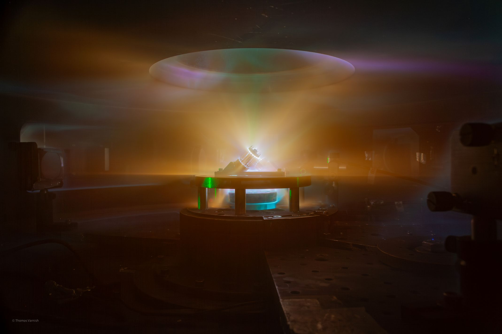
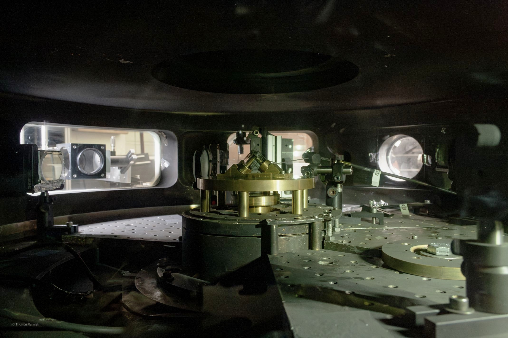
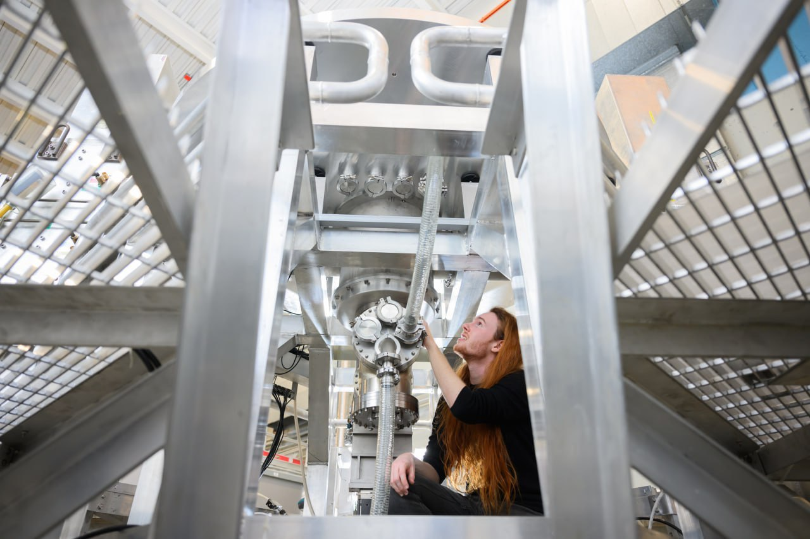

    <a href="mailto:tvarnish@mit.edu?subject=Job Opportunity&body=Hi Thomas,  I'm <insert name here> and let me tell you about this amazing job opportunity I think you'd be perfect for! :)">
    

        
 I'm currently looking for <b>internship and full-time opportunities</b>, particularly those which combine my broad range of <b>creative and technical skills.</b> 

    

    </a>

Hi! I'm Thomas, a final-year PhD student in the Department of Nuclear Science and Engineering ([NSE](http://web.mit.edu/nse/)) at MIT.
My research---at the [PSFC](https://www.psfc.mit.edu/), under the supervision of [Prof. Jack Hare](https://www.jackdhare.net/)---revolves around astrophysically-relevant fundamental plasma physics.
Right now, I'm designing and conducting novel experiments to study experimental pulsed-power driven magnetic reconnection in the presence of a guide field, on machines such as [PUFFIN](https://puffin.ece.cornell.edu/), [MAIZE](https://plasmabay.engin.umich.edu/research/michigan-accelerator-for-inductive-z-pinch-experiments-maize/), and [COBRA](https://www.lps.cornell.edu/).
This research will help us better understand the underlying physics behind the mechanisms that drive massive explosions---coronal mass ejections---on the surface of the sun!
Generally speaking, my research interests lie at the intersection of plasma physics, laboratory astrophysics, astrophysics (the won't-fit-in-a-lab kind), optical diagnostics, and instrumentation.
If I can get my hands dirty in the lab, and design some brand-new hardware to do it, <i>I'm in.</i>

<!-- 

    
    
 A long-exposure image taken of my tilted exploding wire array experiments on the MAIZE facility at the University of Michigan. 

 -->

    
        
        
        
    

    
 Before/after long-exposure images taken of my tilted exploding wire array experiments on the COBRA facility at Cornell University. In the second picture, the image is entirely lit by glowing plasma, over ~100-billionths of a second! 

I'm currently anticipating graduating in Fall 2026, with a PhD in Nuclear Science and Engineering, and a minor in Photography and Related Media.
A fast learner and skilled at hands-on problem-solving/making, with optics and pulsed-power engineering knowledge, I'm looking for exciting opportunities to combine my technical and creative skills. 
Please reach out if you are interested in talking!

    
    
 Photo Credit: Gretchen Ertl. 

In 2021, I completed my undergraduate MSci degree in Physics at [Imperial College London](https://imperial.ac.uk/).
For my final-year MSci research project, I worked alongside Dr. David Clements (Imperial), Dr. Chris Pearson (RAL), and Xinni Wu (Imperial) on data from [ESA's Herschel Space Observatory](https://www.cosmos.esa.int/web/herschel/home) to study the evolution of dusty star-forming galaxies.
The *Herschel* mission has long since been decommissioned (2009&ndash;2013), so we applied some fancy statistical techniques to *squeeze* out as much science as possible from the legacy observations.
Our first two papers from this researchannouncing the deepest-ever far-infrared observations made by the Herschel Space Observatory have been published---and heavily featured by 24 online news outlets---in the *Monthly Notices of the Royal Astronomical Society* (MNRAS) Journal!
You can view a list of my [academic publications here](/publications).

Outside of physics, I enjoy photography (particularly with film), gaming, baking, knitting, art, crafting... and generally making things! 
You can find my photography portfolio here: [photo.thomasvarnish.co.uk](https://photo.thomasvarnish.co.uk/), including some of my [published work](https://www.pride.com/rhode-island-pride-2025).

For a summary of my CV, [click here](/cv). 
If you'd like more detail, please see my [LinkedIn](https://linkedin.com/in/{{ site.author.linkedin }}) page for a more complete profile.

If you'd like to contact me, feel free to [send me an email](mailto:tvarnish@mit.edu).

I created this website from scratch as a side project. It's built upon GitHub Pages and the Jekyll static-site framework, but all the HTML and CSS you see here was custom-written. All the code can be <a href="https://github.com/{{ site.author.github }}/{{ site.author.github }}.github.io">found on my GitHub</a>, so feel free to take a look if you're interested!

