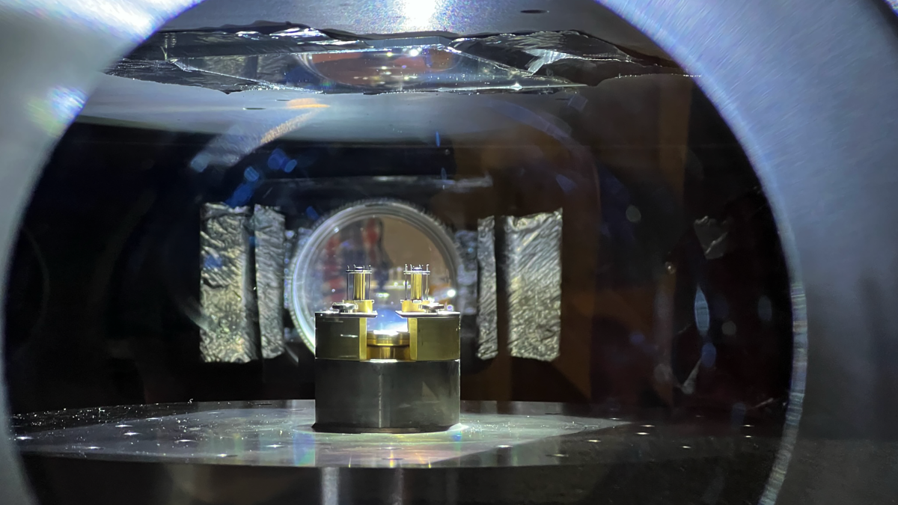

Hi! I'm Thomas, a second-year PhD student in the Department of Nuclear Science and Engineering ([NSE](http://web.mit.edu/nse/)) at MIT. My research---at the [PSFC](https://www.psfc.mit.edu/), under the supervision of [Prof. Jack Hare](https://fusionandthings.eu/)---revolves around astrophysically-relevant fundamental plasma physics on the soon-to-be-constructed [PUFFIN](https://puffin.mit.edu) pulsed-power facility. Right now, I'm studying experimental pulsed-power driven magnetic reconnection in the presence of a guide field. Generally speaking, my research interests lie at the intersection of plasma physics, laboratory astrophysics, astrophysics (the won't-fit-in-a-lab kind), and instrumentation.

In 2021, I completed my undergraduate MSci degree in Physics at [Imperial College London](https://imperial.ac.uk/). For my final-year MSci research project, I worked alongside Dr. David Clements (Imperial), Dr. Chris Pearson (RAL), and Xinni Wu (Imperial) on data from [ESA's Herschel Space Observatory](https://www.cosmos.esa.int/web/herschel/home) to study the evolution of dusty star-forming galaxies. The *Herschel* mission has long since been decommissioned (2009&ndash;2013), so we applied some fancy statistical techniques to *squeeze* out as much science as possible from the legacy observations.

Outside of physics, I enjoy baking, knitting, skiing, and making things! Be sure to check out my [Twitter](https://twitter.com/{{ site.author.twitter }}) page for updates on those sorts of thing.

For a summary of my CV, [click here](/cv). If you'd like more detail, please see my [LinkedIn](https://linkedin.com/in/{{ site.author.linkedin }}) page for a more complete (and up-to-date) profile.

If you'd like to contact me, feel free to [send me an email](mailto:tvarnish@mit.edu) or reach out to me on [Twitter](https://twitter.com/{{ site.author.twitter }}).

I created this website from scratch as a side project. It's built upon GitHub Pages and the Jekyll static-site framework, but all the HTML and CSS you see here was custom-written. All the code can be <a href="https://github.com/{{ site.author.github }}/{{ site.author.github }}.github.io">found on my GitHub</a>, so feel free to take a look if you're interested!

